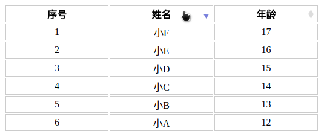

Angular1.x 表格排序模块
====

### 项目介绍
angularjs1.x 表格排序插件，虽然`angular1.x`已经很老了，但是老的项目该维护还是需要维护的，老项目的新需求该实现还得实现，所以有了这个项目。

### 效果截图


### 使用方法
```html
<table sortable-table on-sort="onSort($attrName, $sortType, $event);">
  <thead>
    <tr>
      <th>序号</th>
      <th sortable-column="name">姓名</th>
      <th sortable-column="age">年龄</th>
    </tr>
  </thead>
  <tbody>
    <tr ng-repeat="item in list">
      <td ng-bind="$index+1"></td>
      <td ng-bind="item.name"></td>
      <td ng-bind="item.age"></td>
    </tr>
  </tbody>
</table>
```
[查看例子](./test/index.html)
